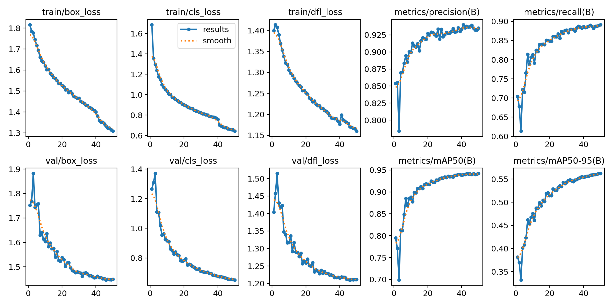
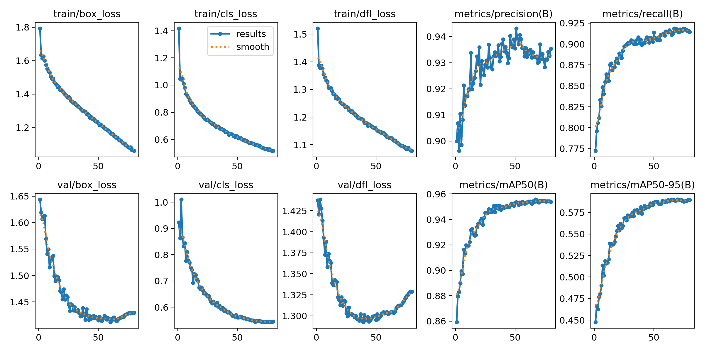
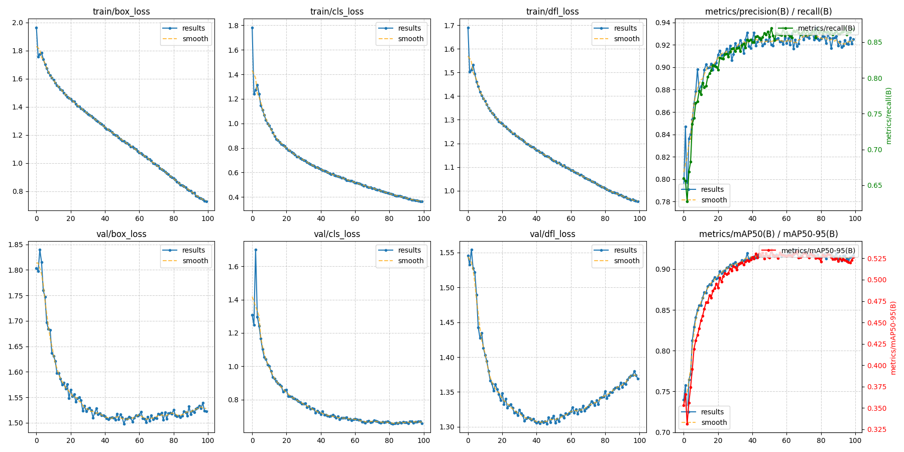
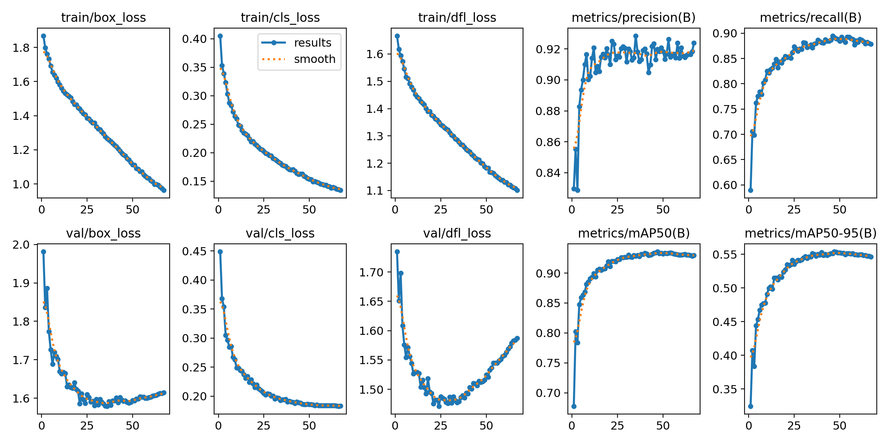
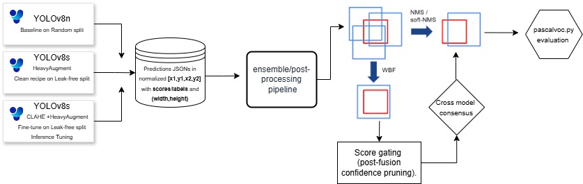
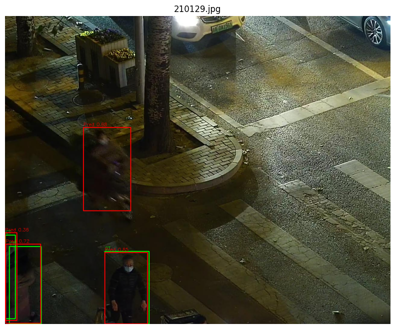
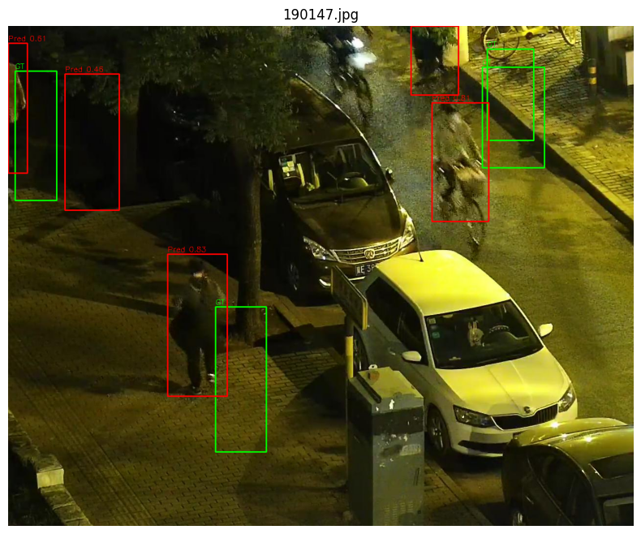
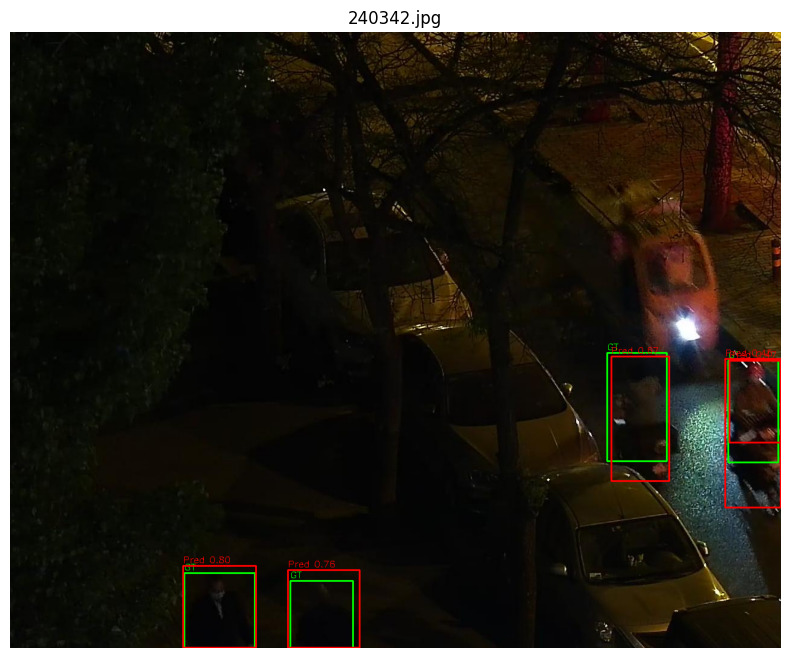
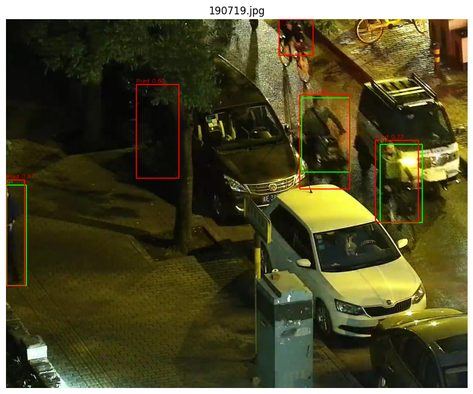
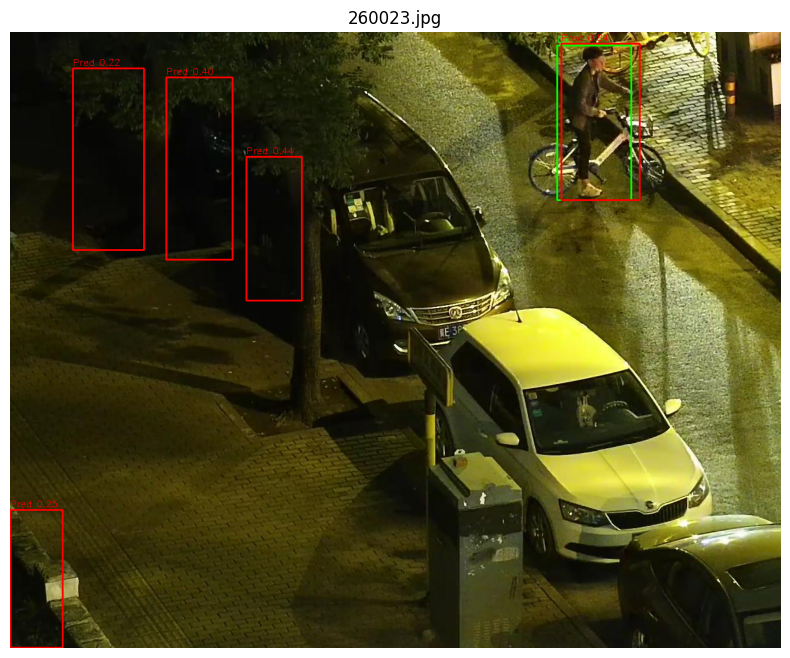

# Low-Light Pedestrian Detection (YOLOv8, Leak-Free Split, WBF Ensemble)

Single-class pedestrian detector for **low-light** images (LLVIP subset).  
This repo provides a **scene/near-duplicate safe split**, tuned **YOLOv8s/n** training recipes, **inference parameter sweeps**, and **Weighted Box Fusion (WBF)** ensembling.

Low-light data is prone to label noise, tiny objects, and validation leakage. To fix this we split the data first, then squeezes reliable gains with smart inference and ensembling.

## Dataset & Paths

Link to Kaggle: https://www.kaggle.com/competitions/find-person-in-the-dark/overview

**Title**: Find Person in the Dark
**Description**: Pedestrian detection in low light conditions.
**Dataset**: The dataset used in this competition contains **15030 visible light images**(11782 images for training and 3248 for testing), it is a subset of LLVIP: A Visible-infrared Paired Dataset for Low-light Vision. 

 - Leak-Free, Scene-Aware Split
 - Groups near-duplicate frames via perceptual hash (pHash) and splits by group to avoid train/val leakage.
 - Inference Tuning (per-model conf/IoU sweep)
```tools/tune_inference.py``` — finds best (conf, iou) for each model on your validation.

- Predict (export per-image JSON for ensembling)
```tools/predict_save.py```
 - Ensembling (WBF+NMS)
```tools/ensemble_wbf.py```
- Ensembling cross validation
```tools/wbf_cv.py```

## Final Results Summary

The most significant performance gain was achieved by combining a clean data split with careful inference parameter tuning.

| Model Name | Local mAP@0.5 | Local mAP@0.75 | Final Kaggle Score (Lower is Better) |
| :--- | :---: | :---: | :---: |
| **WBF Ensemble (best)**| 0.8772 | 0.5634  | **0.27970**|
| **YOLOv8s - Fine-tuned (Best Model)** | **0.9025** | **0.5348** | **0.28135** |
| YOLOv8s - Heavy Augmentation | 0.8800 | 0.5071 | 0.30645 | 
| YOLOv8n - Baseline | 0.8468 | 0.4839 | 0.33465 |
| YOLOv8s - Clean Split + imgsz=960 | 0.8382 | 0.4677 | 0.34705 |
| YOLOv8s - Custom Trainer | 0.6791 | 0.2397 | 0.54060 |

---

## Detailed Model Experimentation

This section provides the full configuration and results for each model variant tested.

### 1. YOLOv8n — Baseline (Random Split)
* **Setup:** `yolov8n.pt` weights, 50 epochs, `imgsz=640`, `batch=16`, using Ultralytics defaults.
* **Notes:** A solid starter model demonstrating the baseline performance on the random data split. Limited by the small backbone size for handling small objects and low-light conditions.

<p align="center">
  
</p>

| Metric ID | Value |
| :--- | :--- |
| `AP@0.5` | 0.8468 |
| `AP@0.75` | 0.4839 |
| **Final Score** | **0.33465** |

### 2. YOLOv8s — CLAHE + Heavy Augmentation (Random Split)
* **Setup:** `yolov8s.pt`, `imgsz=800`, 100 epochs, **SGD optimizer**, `mosaic=1.0`, `hsv_v=0.5`, `scale=0.5`. Used **CLAHE** as a preprocessing step.
* **Notes:** Achieved high local AP, but the aggressive augmentations (CLAHE, high HSV values) and noisy data likely introduced artifacts.
* 
<p align="center">
  
</p>

| Metric ID | Value |
| :--- | :--- |
| `AP@0.5` | 0.8800 |
| `AP@0.75` | 0.5071 |
| **Final Score** | **0.30645** |

### 3. YOLOv8s — Custom Trainer + Albumentations (Random Split)
* **Setup:** Custom Dataset/collate function; heavy **Albumentations** pipeline (Flip, Rotate90, ColorJitter, Resize); `imgsz=800`.
* **Notes:** The custom pipeline resulted in the worst performance. Issues included a pipeline mismatch (e.g., handling bounding box coordinates during `Rotate90`), inconsistent scaling, and an initial error of dropping "negative" samples, causing significant divergence from the standard Ultralytics trainer behavior.

<p align="center">
  
</p>

| Metric ID | Value |
| :--- | :--- |
| `AP@0.5` | 0.6791 |
| `AP@0.75` | 0.2397 |
| **Final Score** | **0.54060** |

### 4. YOLOv8s — Clean Recipe on Leak-Free Split (New Split)
* **Setup:** `yolov8s.pt`, `imgsz≈960`, **AdamW** + cosine LR schedule, reduced `mosaic≈0.25`, no `rotate90`, negatives kept, and a single-class loss bias (increased box loss weight, reduced classification loss weight, added focal loss).
* **Notes:** Focused on data hygiene by using a **leak-free (scene-aware)** data split. This configuration served as a fast, stable backbone model used for ensembling and threshold tuning.

<p align="center">
  
</p>

| Metric ID | Value |
| :--- | :--- |
| `AP@0.5` | 0.8382 |
| `AP@0.75` | 0.4677 |
| **Final Score** | **0.34705** |

### 5. YOLOv8s — Fine-tuned (from Model #2) on Leak-Free Split + Inference Tuning
* **Setup:** Started from the best weights of Model #2, then fine-tuned on the **new leak-free split** (from Model #4). Inference parameters were swept and optimized, leading to the best result at `conf=0.10` and `iou=0.55`.
* **Notes:** This model proved that the combination of clean, high-quality data (new split) and meticulous calibration of post-processing (confidence and NMS thresholds) yielded the greatest gain, moving the final score to the second-top result.

<p align="center">
  
</p>

| Metric ID | Value |
| :--- | :--- |
| `AP@0.5` | 0.9025 |
| `AP@0.75` | 0.5348 |
| **Final Score** | **0.28135** |

---

## Post-Processing & Ensemble Strategy (WBF and NMS)

I've implemented an advanced ensemble pipeline centered on **Weighted Boxes Fusion (WBF)**, moving beyond simple NMS to maximize localization precision from the three best trained detectors.

### 🧬 End-to-End Ensemble Pipeline Steps

Our pipeline is an 11-step, repeatable process designed to optimize for the **Kaggle-style metric** 

$$\text{Score} = ((1 - \text{AP}_{50}) + (1 - \text{AP}_{75})) / 2$$

1.  **Export & Cache Predictions** (Per-model JSONs)
2.  **Weighted Boxes Fusion (WBF)** (Fuse boxes based on `IOU_THR`, `SKIP_BOX_THR`)
3.  **Post-WBF Score Filter** (`FINAL_SCORE_THR`)
4.  **Pixel Conversion** (Normalize to Integer Pixels)
5.  **Consensus Filter (Optional)** (Filter by `MIN_MODELS` agreement)
6.  **Final NMS** (Deduplication with `FINAL_NMS_IOU`)
7.  **Max Detections Cap** (`MAX_DETS`)
8.  **Write Detections** (Competition Format)
9.  **Grid Search** (Sweep over all key ensemble parameters)
10. **Official Evaluation** (Compute AP@0.50 and AP@0.75)
11. **Compute Competition Score** (Final metric optimization)

### Automated Parameter Optimization via Grid Search --> ```tools/wbf_cv.py```

To find the optimal ensemble configuration, we execute a grid search over key hyperparameters that govern the fusion and filtering process.

<p align="center">
  
</p>

| Parameter | Description | Role in WBF/Filtering |
| :--- | :--- | :--- |
| `IOU_THR` | WBF merge IoU | Minimum overlap required for boxes from different models to be merged by WBF. |
| `SKIP_BOX_THR` | Per-model Pre-filter | Per-model predictions below this score are discarded *before* the WBF fusion step. |
| `FINAL_SCORE_THR` | Post-WBF Score Filter | Fused boxes must have a score $\ge$ this value to survive the initial cleanup. |
| `FINAL_NMS_IOU` | Final NMS Deduplication | IoU threshold for the final deduplication pass on the fully fused box set. |
| `MIN_MODELS` | Consensus Gating Requirement | **Crucial for FP reduction:** A fused box must be supported by at least this many source models to be accepted. |
| `MAX_DETS` | Detections Cap | Keeps only the top-K highest scoring boxes per image to stabilize results and meet evaluation limits. |

***

## Ensemble & Post-Processing Experiments

**Best configuration found**

```AP50 = 0.8772
AP75 = 0.5634
score = 0.27970 (lower is better)
cfg = (IOU_THR=0.65, SKIP_BOX_THR=0.005, FINAL_SCORE_THR=0.20, FINAL_NMS_IOU=0.55, MIN_MODELS=1, MAX_DETS=5)
```

## Setup Overview

**Inputs**
- Trained detector checkpoints (5 models total; 3 were ensembled in the sweep).
- Per-image prediction JSON files, one folder per model:
  - Each JSON contains:
    - `width`, `height`
    - `boxes` (normalized `[x1,y1,x2,y2]` in `[0,1]`)
    - `scores`, `labels` (single class: `person`)
- Ground-truth txt files in the evaluator folder: `evaluate/groundtruths/`
---
## Grid Search

- Cartesian grid over 6 hyperparameters → **216 variants**.
- For each variant:
  1. Fuse → filter → NMS → cap
  2. Write `detections/*.txt`
  3. Evaluate at IoU 0.50 and 0.75
  4. Log `AP50`, `AP75`, and `score`
- After all variants, print **Top-10** and the **Best** configuration with its output directory.

## Best Result (from this sweep)
```
score=0.27970
AP50=0.8772
AP75=0.5634
cfg=(IOU_THR=0.65, SKIP_BOX_THR=0.005, FINAL_SCORE_THR=0.20, FINAL_NMS_IOU=0.55, MIN_MODELS=1, MAX_DETS=5)
```

**Interpretation**
- **High recall at 0.50 IoU** (AP50 ≈ 0.88).
- **Moderate tightness at 0.75 IoU** (AP75 ≈ 0.56).
**Note:** The ensemble slightly **outperforms the best single model** on the final score
(0.27970 vs 0.28135) by trading a bit of AP@0.5 for a higher AP@0.75.

## Qualitative Results & Error Analysis

Below are representative examples from the **best ensemble** (WBF + consensus + final NMS).  
Green = **GT (ground truth)**, Red = **Prediction** with confidence.

- **True Positives (TP) with good localization** — clean overlaps, high confidence.  
- **Borderline IoU / Localization errors** — boxes touch the person but are slightly offset; often pass at IoU=0.50 but fail at 0.75.  
- **Valid-but-unlabeled detections (looks like FPs, actually label noise)** — the model finds a person the GT missed.  
- **Over-detections / Hallucinations** — elongated shadows, trees, or bikes in highlight/glare regions trigger a person box.  
- **Misses (FN)** — tiny, heavily occluded, or very dark pedestrians.

### Examples
<!-- Row 1: two images with captions -->
<table>
  <tr>
    <td align="center" width="50%">
      <br/>
      <sub>Clear TP on cyclist; low-confidence boxes in dark foliage pruned by final NMS/score gating.</sub>
    </td>
    <td align="center" width="50%">
      <br/>
      <sub>Multiple TPs with tight localization. </sub>
    </td>
  </tr>
</table>

<!-- Row 2: two images with captions -->
<table>
  <tr>
    <td align="center" width="50%">
      <br/>
      <sub>Mixed scene; WBF merges overlapping model votes into a single, stable detection.</sub>
    </td>
    <td align="center" width="50%">
      <br/>
      <sub>Slight GT/pred box misalignment. </sub>
    </td>
  </tr>
</table>

<!-- Row 3: single image with caption -->
<p align="center">
  <br/>
  <sub>A few over-detections on shadows/vertical structures. </sub>
</p>


### Error taxonomy & mitigations

| Error Type | Visual Symptom | Why it happens | Mitigation |
|---|---|---|---|
| **Borderline IoU (localization)** | Red box shifted vs. green | Motion blur, fast bikes, partial occlusion; anchor-free heads biased | Train with higher `imgsz`, add motion blur aug, stronger box loss weight; consider box refinement (TTA or deformable heads) |
| **Valid but unlabeled (label noise)** | Clear person with no GT box | Noisy low-light labels | Relabel pass; weak-labeling (pseudo-GT) + noise-robust loss |
| **Hallucination / FP** | Boxes on shadows/trees/glare | Low contrast + high specular highlights | Calibrate thresholds, consensus gating (`MIN_MODELS≥2`), glare-aware augmentations |
| **Miss (FN)** | Person present but no red box | Very small/occluded/far | Larger `imgsz`, multiscale training, focal loss, small-object priors |

## Further Improvements — Other Pre-Trained Models & Side Techniques

### Try stronger pre-trained detectors
- **YOLO family:** YOLOv8-l/x, **YOLOv9-s/l**, **YOLOv11-s/l**.
- **Anchor-free one-stage:** **PP-YOLOE-S/M**, **YOLOX-S/M**.
- **Transformer detectors (small variants):** **RT-DETR-R18/R50**, **DINO-DETR-Tiny/Small** (often better on crowded scenes).
- **Two-stage classics:** **Faster R-CNN / Cascade R-CNN** with **ResNet50/ConvNeXt-T** backbones (strong high-IoU boxes).

### Side techniques (no retraining or light-touch)
- **TTA at inference:** horizontal flip + multi-scale (0.8×/1.0×/1.2×); fuse with **WBF**.
- **Soft-NMS** as the final dedup step (swap for hard NMS in the ensemble script).
- **Per-model WBF weights:** tune with Optuna or simple grid (e.g., favor the best AP@0.75 model).
- **Confidence calibration:** temperature scaling on the leak-free val set (improves ranking at 0.75 IoU).
- **Tiling for large frames:** slide windows with 20–30% overlap; merge tiles with WBF.
- **Low-light enhancement as a branch:** run CLAHE/Retinex on copies of the image, predict with one strong model, and fuse with the raw branch.
- **Pseudo-labeling (light):** add only **very high-confidence** predictions from the best model to boost recall on dark scenes, then re-export for ensembling.


