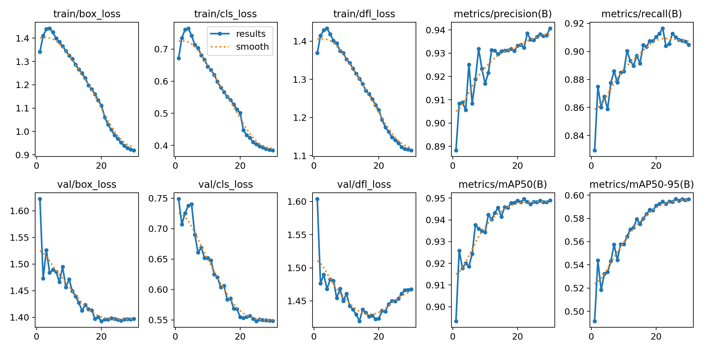

# Low-Light Pedestrian Detection (YOLOv8, Leak-Free Split, WBF Ensemble)

Single-class pedestrian detector for **low-light** images (LLVIP subset).  
This repo provides a **scene/near-duplicate safe split**, tuned **YOLOv8s/n** training recipes, **inference parameter sweeps**, and **Weighted Box Fusion (WBF)** ensembling to produce a robust final submission.

Low-light data is prone to label noise, tiny objects, and validation leakage. To fix this we split the data first, then squeezes reliable gains with smart inference and ensembling.

---


---

## 🌱 Dataset & Paths

Link to Kaggle: https://www.kaggle.com/competitions/find-person-in-the-dark/overview

**Title**: Find Person in the Dark
**Description**: Pedestrian detection in low light conditions.
**Dataset**: The dataset used in this competition contains **15030 visible light images**(11782 images for training and 3248 for testing), it is a subset of LLVIP: A Visible-infrared Paired Dataset for Low-light Vision. 

Leak-Free, Scene-Aware Split

Groups near-duplicate frames via perceptual hash (pHash) and splits by group to avoid train/val leakage.
```tools/split_scene_aware.py```

Inference Tuning (per-model conf/IoU sweep)
```tools/tune_inference.py``` — finds best (conf, iou) for each model on your validation.

Predict (export per-image JSON for ensembling)
```tools/predict_save.py```

Ensembling (WBF) → YOLO-TXT & CSV
```tools/ensemble_wbf.py```

## Results

#  pedestrian-detection: YOLOv8 Experiment Log

This repository documents the training, experimentation, and results for a pedestrian detection task, primarily utilizing **YOLOv8** models. The focus of this work was to move beyond the baseline and explore the impact of augmentation, custom training loops, and data splitting strategies on final performance.

---

## 🚀 Final Results Summary

The most significant performance gain was achieved by combining a clean data split with careful inference parameter tuning.

| Model Name | Local mAP@0.5 | Local mAP@0.75 | Final Kaggle Score (Lower is Better) | Key Takeaway |
| :--- | :---: | :---: | :---: | :--- |
| **YOLOv8s - Fine-tuned (Best Model)** | **0.9025** | **0.5348** | **0.28135** | Data hygiene + calibrated inference is key. |
| YOLOv8s - Heavy Augmentation | 0.8800 | 0.5071 | 0.30645 | High local AP, but overfitting/FP issues. |
| YOLOv8n - Baseline | 0.8468 | 0.4839 | 0.33465 | Solid starting point (YOLOv8n). |
| YOLOv8s - Clean Split + imgsz=960 | 0.8382 | 0.4677 | 0.34705 | Confirmed stability on new split. |
| YOLOv8s - Custom Trainer | 0.6791 | 0.2397 | 0.54060 | Custom pipeline flaws significantly hurt performance. |

---

## 📈 Training Process Illustrations

The following plots demonstrate the training and validation behavior of the **YOLOv8n Baseline model** over 50 epochs. These visualizations are critical for diagnosing convergence, loss trends, and potential overfitting/underfitting.


### Key Observations from Baseline Plots:

* **Loss Convergence:** All loss components (`box_loss`, `cls_loss`, `dfl_loss`) show smooth and consistent convergence across both training (`train/`) and validation (`val/`) sets.
* **Validation Loss:** Validation losses consistently track or stay slightly above the training losses, indicating good generalization without severe overfitting.
* **Metrics:** Metrics (Precision, Recall, mAP) show rapid increase in the first 10-20 epochs, plateauing afterwards.

---

## 🔬 Detailed Model Experimentation

This section provides the full configuration and results for each model variant tested.

### 1. YOLOv8n — Baseline (Random Split)
* **Setup:** `yolov8n.pt` weights, 50 epochs, `imgsz=640`, `batch=16`, using Ultralytics defaults.
* **Notes:** A solid starter model demonstrating the baseline performance on the original data split. Limited by the small backbone size for handling small objects and low-light conditions.

<p align="center">
  
</p>

| Metric ID | Value |
| :--- | :--- |
| `AP@0.5` | 0.8468 |
| `AP@0.75` | 0.4839 |
| **Final Score** | **0.33465** |

### 2. YOLOv8s — CLAHE + Heavy Augmentation (Random Split)
* **Setup:** `yolov8s.pt`, `imgsz=800`, 100 epochs, **SGD optimizer**, `mosaic=1.0`, `hsv_v=0.5`, `scale=0.5`. Used **CLAHE** as a preprocessing step.
* **Notes:** Achieved high local AP, but the aggressive augmentations (CLAHE, high HSV values) and noisy data likely introduced artifacts, leading to an increase in False Positives and a slight degradation in the final score compared to the best model.

<p align="center">
  
</p>

| Metric ID | Value |
| :--- | :--- |
| `AP@0.5` | 0.8800 |
| `AP@0.75` | 0.5071 |
| **Final Score** | **0.30645** |

### 3. YOLOv8s — Custom Trainer + Albumentations (Random Split)
* **Setup:** Custom Dataset/collate function; heavy **Albumentations** pipeline (Flip, Rotate90, ColorJitter, Resize); `imgsz=800`.
* **Notes:** The custom pipeline resulted in the worst performance. Issues included a pipeline mismatch (e.g., handling bounding box coordinates during `Rotate90`), inconsistent scaling, and an initial error of dropping "negative" samples, causing significant divergence from the standard Ultralytics trainer behavior.

<p align="center">
  
</p>

| Metric ID | Value |
| :--- | :--- |
| `AP@0.5` | 0.6791 |
| `AP@0.75` | 0.2397 |
| **Final Score** | **0.54060** |

### 4. YOLOv8s — Clean Recipe on Leak-Free Split (New Split)
* **Setup:** `yolov8s.pt`, `imgsz≈960`, **AdamW** + cosine LR schedule, reduced `mosaic≈0.25`, no `rotate90`, negatives kept, and a single-class loss bias (increased box loss weight, reduced classification loss weight, added focal loss).
* **Notes:** Focused on data hygiene by using a **leak-free (scene-aware)** data split. This configuration served as a fast, stable backbone model used for ensembling and threshold tuning.

<p align="center">
  
</p>

| Metric ID | Value |
| :--- | :--- |
| `AP@0.5` | 0.8382 |
| `AP@0.75` | 0.4677 |
| **Final Score** | **0.34705** |

### 5. YOLOv8s — Fine-tuned (from Model #2) on Leak-Free Split + Inference Tuning
* **Setup:** Started from the best weights of Model #2, then fine-tuned on the **new leak-free split** (from Model #4). Inference parameters were swept and optimized, leading to the best result at `conf=0.10` and `iou=0.55`.
* **Notes:** This model proved that the combination of clean, high-quality data (new split) and meticulous calibration of post-processing (confidence and NMS thresholds) yielded the greatest gain, moving the final score to the top result.

<p align="center">
  
</p>

| Metric ID | Value |
| :--- | :--- |
| `AP@0.5` | 0.9025 |
| `AP@0.75` | 0.5348 |
| **Final Score** | **0.28135** |

---

## ⚙️ Post-Processing & Ensemble Strategy (WBF and NMS)

We implemented an advanced ensemble pipeline centered on **Weighted Boxes Fusion (WBF)**, moving beyond simple NMS to maximize localization precision from the five trained detectors.

| Technique | Role in Pipeline | Intuition / Why it's Better |
| :--- | :--- | :--- |
| **Weighted Boxes Fusion (WBF)** | Primary ensembling method (Step 2) | **Fusion over Suppression:** Averages coordinates of overlapping boxes from multiple models, refining geometry and preserving recall better than NMS. |
| **Simple NMS Baseline** | Sanity Check | Used as a reference point; typically trails WBF on multi-model ensembles because it discards valuable positional information. |
| **Consensus Gating** (`MIN_MODELS`) | False Positive Reduction (Step 5) | **Forced Agreement:** Requires a fused box to be supported by a minimum number of individual models, aggressively cutting out False Positives. |
| **Final NMS Pass** | Final Deduplication (Step 6) | A light cleanup step run *after* WBF and consensus filtering to remove any final, near-duplicate boxes within the single fused set. |

### 🧬 End-to-End Ensemble Pipeline Steps

Our pipeline is an 11-step, repeatable process designed to optimize for the **Kaggle-style metric** ($\text{Score} = ((1 - \text{AP}_{50}) + (1 - \text{AP}_{75})) / 2$).

1.  **Export & Cache Predictions** (Per-model JSONs)
2.  **Weighted Boxes Fusion (WBF)** (Fuse boxes based on `IOU_THR`, `SKIP_BOX_THR`)
3.  **Post-WBF Score Filter** (`FINAL_SCORE_THR`)
4.  **Pixel Conversion** (Normalize to Integer Pixels)
5.  **Consensus Filter (Optional)** (Filter by `MIN_MODELS` agreement)
6.  **Final NMS** (Deduplication with `FINAL_NMS_IOU`)
7.  **Max Detections Cap** (`MAX_DETS`)
8.  **Write Detections** (Competition Format)
9.  **Grid Search** (Sweep over all key ensemble parameters)
10. **Official Evaluation** (Compute AP@0.50 and AP@0.75)
11. **Compute Competition Score** (Final metric optimization)

### 🧪 Automated Parameter Optimization via Grid Search

To find the optimal ensemble configuration, we execute a grid search over key hyperparameters that govern the fusion and filtering process.

| Parameter | Description | Role in WBF/Filtering |
| :--- | :--- | :--- |
| `IOU_THR` | WBF merge IoU | Minimum overlap required for boxes from different models to be merged by WBF. |
| `SKIP_BOX_THR` | Per-model Pre-filter | Per-model predictions below this score are discarded *before* the WBF fusion step. |
| `FINAL_SCORE_THR` | Post-WBF Score Filter | Fused boxes must have a score $\ge$ this value to survive the initial cleanup. |
| `FINAL_NMS_IOU` | Final NMS Deduplication | IoU threshold for the final deduplication pass on the fully fused box set. |
| `MIN_MODELS` | Consensus Gating Requirement | **Crucial for FP reduction:** A fused box must be supported by at least this many source models to be accepted. |
| `MAX_DETS` | Detections Cap | Keeps only the top-K highest scoring boxes per image to stabilize results and meet evaluation limits. |

***

# Ensemble & Post-Processing Experiments

## TL;DR
We trained multiple YOLOv8 models, exported per-image predictions to JSON, and ran a grid search over **Weighted Boxes Fusion (WBF)** + **post-filters** (score gating, optional cross-model consensus, final NMS, and max-detections cap).  
We evaluated with the official `pascalvoc.py` at **IoU=0.50** and **IoU=0.75**, and ranked configurations by the competition metric **MAE-to-1**:
\[
\text{score}=\frac{(1-AP_{50})+(1-AP_{75})}{2}
\]

**Best configuration found**
AP50 = 0.8772
AP75 = 0.5634
score = 0.27970 (lower is better)
cfg = (IOU_THR=0.65, SKIP_BOX_THR=0.005, FINAL_SCORE_THR=0.20, FINAL_NMS_IOU=0.55, MIN_MODELS=1, MAX_DETS=5)


---

## Setup Overview

**Inputs**
- Trained detector checkpoints (5 models total; 3 were ensembled in the sweep).
- Per-image prediction JSON files, one folder per model:
  - Each JSON contains:
    - `width`, `height`
    - `boxes` (normalized `[x1,y1,x2,y2]` in `[0,1]`)
    - `scores`, `labels` (single class: `person`)
- Ground-truth txt files in the evaluator folder: `evaluate/groundtruths/`

**Core scripts**
- `sweep_wbf.py` — runs the grid search, writes detection txts, calls `pascalvoc.py`, and summarizes results.
- `overlay_viz.py` — utilities to visualize predictions vs. ground truth (optional).

---

## Methods

### 1) Base Predictions
Export raw per-image predictions from each model into JSON (normalized coords).

### 2) Fusion: Weighted Boxes Fusion (WBF)
- Stack predictions from selected models and fuse overlapping boxes via **WBF** (`ensemble_boxes.weighted_boxes_fusion`).
- **Grid params**:
  - `IOU_THR` ∈ {0.60, 0.65, 0.68}
  - `SKIP_BOX_THR` ∈ {0.005, 0.01, 0.02}
- **Model weights**: `[1.2, 1.0, 1.0]` (normalized internally).

### 3) Post-fusion Filters
- **Score gating**: drop fused boxes with `score < FINAL_SCORE_THR`, where  
  `FINAL_SCORE_THR` ∈ {0.20, 0.22, 0.25}.
- **Cross-model consensus (optional)**:
  - Keep a fused box only if at least `MIN_MODELS` raw models support it with IoU ≥ `SUPPORT_IOU = 0.50`.
  - `MIN_MODELS` ∈ {1 (off), 2}.
- **Final NMS**:
  - Apply `torchvision.ops.nms` with `FINAL_NMS_IOU` ∈ {0.50, 0.55}.
- **Max detections cap**:
  - Keep the top-K by confidence: `MAX_DETS` ∈ {4, 5}.

### 4) Evaluation
- For each configuration, detections are written into a fresh `detections/` folder and copied under the evaluator directory.
- Run `pascalvoc.py` twice:
  - `--threshold 0.50` → **AP50**
  - `--threshold 0.75` → **AP75**
- Compute the leaderboard score:  
  `score = ((1 - AP50) + (1 - AP75)) / 2`.

> The script creates unique result directories to avoid overwrite prompts and auto-feeds `"Y\n"` if the evaluator asks.

---

## Grid Search

- Cartesian grid over 6 hyperparameters → **216 variants**.
- For each variant:
  1. Fuse → filter → NMS → cap
  2. Write `detections/*.txt`
  3. Evaluate at IoU 0.50 and 0.75
  4. Log `AP50`, `AP75`, and `score`
- After all variants, print **Top-10** and the **Best** configuration with its output directory.

---

## Best Result (from this sweep)

score=0.27970
AP50=0.8772
AP75=0.5634
cfg=(IOU_THR=0.65, SKIP_BOX_THR=0.005, FINAL_SCORE_THR=0.20, FINAL_NMS_IOU=0.55, MIN_MODELS=1, MAX_DETS=5)


**Interpretation**
- **High recall at 0.50 IoU** (AP50 ≈ 0.88).
- **Moderate tightness at 0.75 IoU** (AP75 ≈ 0.56).
- Consensus didn’t help here (`MIN_MODELS=1`), suggesting fusing all signals and a light NMS was superior to aggressive pruning.

---

## Simple WBF vs. Simple NMS (Notes)

We also compared simpler baselines:
- **Simple NMS only**: run NMS on one model’s predictions.
- **Simple WBF only**: fuse model predictions with WBF, then minimal filtering.
- In our setting the **full pipeline** (WBF → score gating → light NMS → top-K) outperformed these simpler variants.

> Add exact numbers below if desired:

| Method | AP50 | AP75 | score |
|---|---:|---:|---:|
| Single model + NMS | _(fill)_ | _(fill)_ | _(fill)_ |
| Simple WBF (no consensus, minimal NMS) | _(fill)_ | _(fill)_ | _(fill)_ |
| **WBF + gating + light NMS + cap (best)** | **0.8772** | **0.5634** | **0.27970** |

---

## Repro & Usage

### 1) Configure paths in `sweep_wbf.py`
```python
MODEL_PREDS = [
    r'X:\Desktop\sergek\preds_raw\train',
    r'X:\Desktop\sergek\preds_raw\yolo_baseline',
    r'X:\Desktop\sergek\preds_raw\yolo_new_split',
]
EVAL_ROOT = Path(r'X:\Desktop\sergek\evaluate\evaluate')   # contains pascalvoc.py and groundtruths/
SWEEP_OUT = Path(r'X:\Desktop\sergek\wbf_sweep')

2) Run the sweep
python sweep_wbf.py

 - Progress, per-variant metrics, Top-10, and Best are printed to console.
 - Each variant’s detections and debug CSV live under SWEEP_OUT/<tag>/.

3) Visual inspection (optional)

```
from overlay_viz import visualize_batch

visualize_batch(
    det_dir=r"X:\Desktop\sergek\wbf_sweep\<best_tag>\detections",
    gt_dir=r"X:\Desktop\sergek\evaluate\evaluate\groundtruths",
    images_dir=r"X:\Desktop\sergek\train\train\train_images",
    num_samples=8,
    iou_thr=0.50,
    seed=1337,
    save_dir=None,     # or an output folder
    show=True
)

```

If raw images aren’t available, overlay_viz.py can draw white canvases sized from JSON metadata—set fallback_json_meta to a predictions folder—but real images are recommended.


